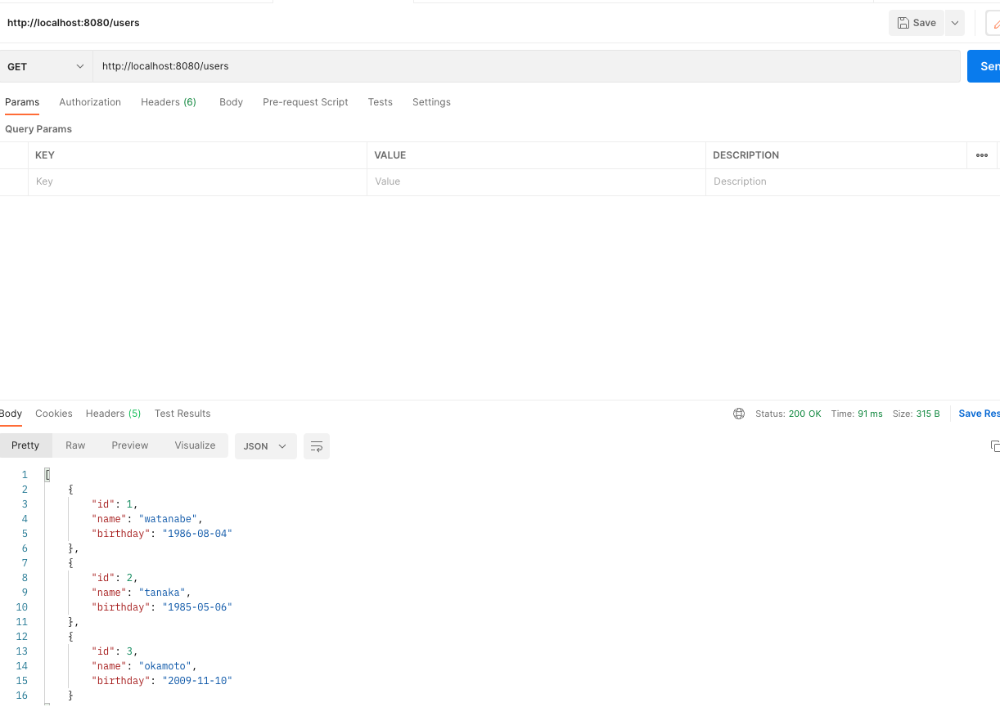
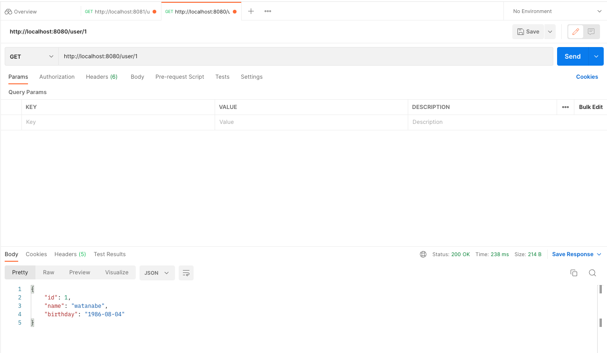
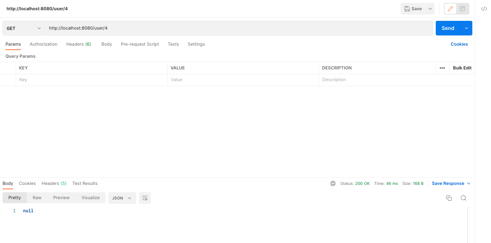

# CRAD処理(途中段階)

## DockerでのMySqlの環境構築
- image: mysql:8.0.28
- container_name: mysql_test
### DBへの接続
- Host: localhost
- Username: root
- Password: root
- Database: test_db
- Port: 3307

## DBの定義
|カラム名|型|Nullable|その他|
| ------- | ------- | ------- | ------- |
|  id| int |NOTNULL|PRIMARY KEY,  AUTO_INCREMENT|
| name |  vaecher(255)|NOTNULL| |
| birthdate | date |NOTNULL| |

## 依存関係
- Project Gradle
- Language Java
- SDK 17
- springweb
- Thymeleaf
- Mybatis Framework
- Mysql Driver

## 出力結果  
  
  
  
